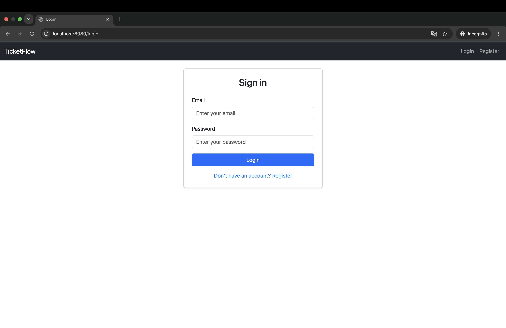
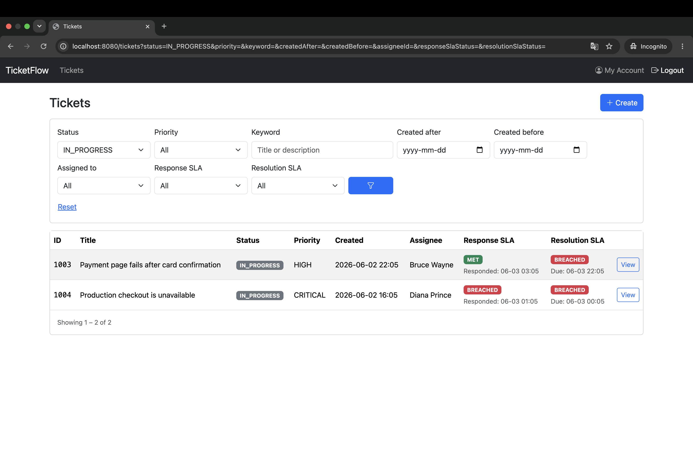
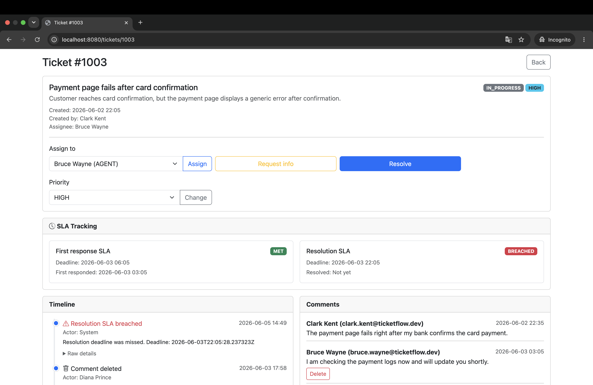
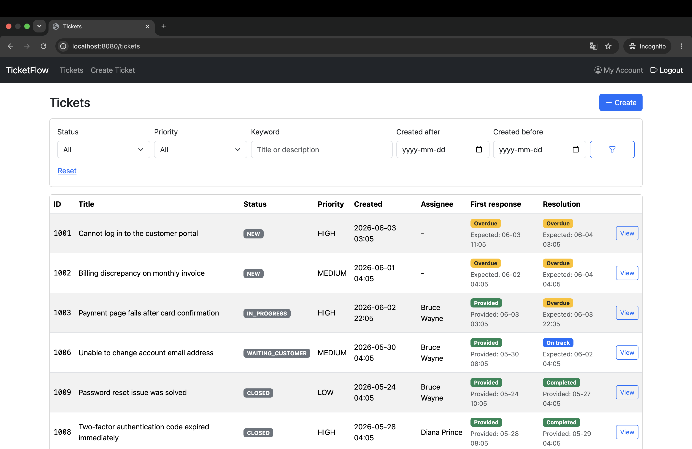
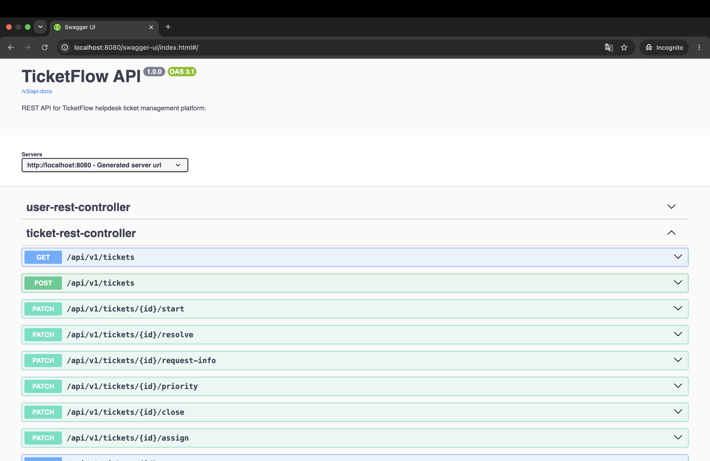

# TicketFlow

A production-style IT support ticket management platform built with **Spring Boot 4** and **Java 21**.

---

## Overview

**TicketFlow** is a full-stack helpdesk application for managing support tickets from creation to resolution. It allows
customers to submit issues, agents to manage and resolve them, and admins to oversee users, workflow, SLA performance,
and operational history.

The system supports three user roles:

- **Customers** — create tickets, track progress, add comments, and close resolved issues.
- **Agents** — work on assigned tickets, communicate with customers, update ticket status, and manage SLA-driven
  workflows.
- **Admins** — manage internal users, monitor all tickets, and have broader control over workflow actions.

TicketFlow is designed to demonstrate realistic backend development practices rather than simple CRUD operations. It
includes role-based security, a controlled ticket lifecycle, priority-based SLA tracking, audit events, dynamic
filtering, pagination, REST API support, database migrations, automated tests, Dockerized deployment, and
production-style observability with request correlation IDs and service-layer AOP logging.

The application provides both a **Thymeleaf web UI** and a **REST API**, making it usable from a browser as well as
through API tools such as Swagger UI or Postman.

---

## Key Features

### Security and Access Control

- Role-based access control for `CUSTOMER`, `AGENT`, and `ADMIN` users.
- Public customer registration and secured login.
- Form-based authentication for the Thymeleaf UI and HTTP Basic authentication for REST API usage.
- Ownership-based rules ensure customers can access only their own tickets.
- Agent/Admin permissions for internal ticket management and workflow actions.
- Centralized authorization logic for ownership checks, assignee checks, author checks, and admin overrides.

### Ticket Lifecycle Management

- Full ticket workflow from creation to closure.
- Controlled ticket lifecycle with a domain-level state machine enforcing valid status transitions.
- Supported statuses: `NEW`, `IN_PROGRESS`, `WAITING_CUSTOMER`, `RESOLVED`, and `CLOSED`.
- Automatic assignment when an internal user starts progress on an unassigned ticket.
- Closed tickets are protected from further modifications.
- Optimistic locking for safer concurrent ticket updates.
- Priority management with four levels: `LOW`, `MEDIUM`, `HIGH`, and `CRITICAL`.

### SLA Tracking

- Priority-based SLA tracking for first response and resolution deadlines.
- Separate first-response and resolution SLA statuses.
- First-response SLA evaluation when an internal user first responds.
- Resolution SLA pause/resume behavior while waiting for customer input.
- Customer replies resume the resolution SLA and extend the deadline by the paused duration.
- Internal reopening of resolved tickets without extending the SLA deadline.
- Scheduled SLA breach detection and auto-close behavior for old resolved tickets.
- SLA visibility and filtering in both the Thymeleaf UI and REST API.

### Comments and Audit Trail

- Customer-agent comments inside tickets.
- Role-aware comment deletion.
- Customer replies can move tickets from `WAITING_CUSTOMER` or `RESOLVED` back to `IN_PROGRESS` when appropriate.
- Internal ticket event audit trail for assignments, status changes, priority changes, comments, SLA events, and system
  actions.
- Audit events stored with flexible JSONB payloads.
- Ticket timeline is available in both the UI and REST API.

### Filtering and Pagination

- Dynamic ticket filtering and pagination using QueryDSL.
- Multi-criteria search by keyword, status, priority, date ranges, assignee, and SLA status.
- Server-side pagination and sorting.
- Role-aware ticket visibility during filtering.

### Web UI and REST API

- Thymeleaf web UI for browser-based usage.
- REST API under `/api/v1/`.
- Swagger/OpenAPI documentation for API exploration.
- Separate handling for web-page errors and JSON API errors.

### Database and Configuration

- PostgreSQL database with Liquibase-based schema migrations.
- SQL changelogs for reproducible database versioning.
- Liquibase contexts for development demo data.
- Demo data for users, tickets, comments, events, and SLA states.
- Separate `dev`, `test`, and `prod` Spring profiles.
- Production datasource configuration through environment variables.

### Observability and Logging

- Request correlation IDs with SLF4J MDC using `X-Request-Id`.
- Service-layer AOP execution logging with duration and failure tracking.
- Structured Logback output with a rolling file appender for the production profile.

### Dockerized Setup

- Multi-stage Docker build for packaging the Spring Boot application.
- Docker Compose setup for running the application and PostgreSQL together.
- One-command local startup for the full application stack.

### Testing

- Comprehensive test suite covering repository, service, REST, MVC, SLA, scheduler, smoke, audit, and integration
  scenarios.
- Testcontainers-based PostgreSQL integration tests.
- MockMvc tests for web and REST layers.
- Spring Security test support for authorization scenarios.

---

## Tech Stack

| Area                | Technologies                                                    |
|---------------------|-----------------------------------------------------------------|
| Backend             | Java 21, Spring Boot 4.0.2                                      |
| Web Layer           | Spring MVC, Thymeleaf                                           |
| Security            | Spring Security, form login, HTTP Basic, method-level security  |
| Persistence         | Spring Data JPA, Hibernate                                      |
| Dynamic Queries     | QueryDSL                                                        |
| Database            | PostgreSQL 16                                                   |
| Database Migrations | Liquibase SQL changelogs                                        |
| Validation          | Jakarta Bean Validation                                         |
| API Documentation   | Springdoc OpenAPI, Swagger UI                                   |
| Observability       | SLF4J, Logback, MDC, Spring AOP                                 |
| Testing             | JUnit 5, Mockito, MockMvc, Spring Security Test, Testcontainers |
| Build Tool          | Maven (with Maven Wrapper)                                      |
| Containerization    | Docker, Docker Compose                                          |
| Utilities           | Lombok, Jackson                                                 |

---

## Architecture / Project Design

TicketFlow follows a layered architecture with a clear separation between HTTP handling, business logic, persistence,
security, and infrastructure concerns.

```text
HTTP Layer (Controllers) → Service Layer (Business Logic) → Repository Layer → Database
```

The application provides two presentation entry points: a Thymeleaf-based web UI and a REST API under `/api/v1/`. Both
entry points use the same service layer, so business rules are implemented once and reused across browser-based pages
and API clients.

### Main Design Decisions

- **Layered structure** — controllers handle HTTP concerns, services contain business logic, repositories handle
  persistence, and entities represent the domain model.
- **Dual HTTP layer** — Thymeleaf controllers handle server-rendered pages, while REST controllers expose JSON endpoints
  under `/api/v1/`.
- **Shared business layer** — the web UI and REST API use the same service layer to avoid duplicated workflow logic.
- **Separate security flows** — the UI uses form-based login, while the REST API supports HTTP Basic authentication for
  API clients.
- **State machine in the domain** — ticket status transitions are controlled by the domain model instead of being
  handled as arbitrary field updates.
- **SLA as a first-class domain concept** — first-response deadlines, resolution deadlines, pause/resume logic, breach
  detection, and auto-close behavior are modeled explicitly with dedicated services and schedulers.
- **Centralized access policy** — ownership checks, assignee checks, author checks, and admin overrides are grouped in a
  dedicated `AccessPolicy` component.
- **Event-based audit trail** — ticket actions are recorded as `TicketEvent` records with flexible JSONB payloads,
  providing a timeline of important business events.
- **DTO mapping layer** — entities are mapped to request/response DTOs to avoid exposing persistence models directly
  through the REST API.
- **Type-safe dynamic filtering** — QueryDSL is used for multi-criteria ticket search, pagination, and role-aware ticket
  visibility.
- **Testable time handling** — a `Clock` bean is used for time-dependent logic, making SLA behavior and scheduled
  processes easier to test deterministically.
- **Versioned database schema** — Liquibase SQL changelogs manage schema evolution and development demo data.
- **Infrastructure-level observability** — request correlation IDs, structured logging, and service execution logging
  are handled separately from business logic.

---

## Ticket Lifecycle

TicketFlow uses a controlled ticket lifecycle instead of allowing arbitrary status updates. Each transition represents a
real workflow action and is validated by the domain model.

### Status Flow

| From               | Action                       | To                 |
|--------------------|------------------------------|--------------------|
| `NEW`              | Start progress               | `IN_PROGRESS`      |
| `IN_PROGRESS`      | Request customer information | `WAITING_CUSTOMER` |
| `WAITING_CUSTOMER` | Customer replies             | `IN_PROGRESS`      |
| `WAITING_CUSTOMER` | Resolve ticket               | `RESOLVED`         |
| `IN_PROGRESS`      | Resolve ticket               | `RESOLVED`         |
| `RESOLVED`         | Reopen ticket                | `IN_PROGRESS`      |
| `RESOLVED`         | Close ticket                 | `CLOSED`           |

### Ticket Statuses

| Status             | Meaning                                                                     |
|--------------------|-----------------------------------------------------------------------------|
| `NEW`              | The ticket has been created but internal work has not started yet.          |
| `IN_PROGRESS`      | An agent or admin is actively working on the ticket.                        |
| `WAITING_CUSTOMER` | Support is waiting for additional information from the customer.            |
| `RESOLVED`         | Support considers the issue solved, but the ticket is not fully closed yet. |
| `CLOSED`           | The ticket is finished and can no longer be modified.                       |

### Workflow Rules

- Customers can create tickets and view only their own tickets.
- Agents and admins can manage tickets according to assignment and workflow rules.
- Starting progress on an unassigned ticket automatically assigns it to the internal user performing the action.
- Tickets can be moved to `WAITING_CUSTOMER` when support needs more information from the customer.
- A ticket can be resolved from either `IN_PROGRESS` or `WAITING_CUSTOMER`.
- Customer replies can move tickets from `WAITING_CUSTOMER` or `RESOLVED` back to `IN_PROGRESS` when appropriate.
- Customers can close their own resolved tickets.
- Closed tickets are treated as final and are protected from further modifications.
- Invalid status transitions are rejected by the domain-level lifecycle rules.

---

## SLA Tracking

TicketFlow includes SLA tracking for both first response and resolution deadlines. SLA rules are based on ticket
priority, so higher-priority tickets receive stricter response and resolution targets.

### Default SLA Policies

| Priority   | First Response |         Resolution |
|------------|---------------:|-------------------:|
| `CRITICAL` |        2 hours |            8 hours |
| `HIGH`     |        8 hours |           24 hours |
| `MEDIUM`   |       24 hours |           72 hours |
| `LOW`      |       48 hours | 168 hours / 7 days |

### SLA Types

| SLA Type           | Purpose                                                                       |
|--------------------|-------------------------------------------------------------------------------|
| First Response SLA | Tracks how quickly an internal user first responds to a newly created ticket. |
| Resolution SLA     | Tracks how quickly the ticket is resolved.                                    |

### SLA Statuses

| Status     | Description                                                          |
|------------|----------------------------------------------------------------------|
| `ON_TRACK` | The SLA deadline has not been reached.                               |
| `PAUSED`   | The resolution SLA clock is paused while waiting for customer input. |
| `MET`      | The SLA target was completed within the deadline.                    |
| `BREACHED` | The SLA deadline was exceeded.                                       |

### SLA Behavior

- First-response and resolution deadlines are calculated when a ticket is created, based on its priority.
- First-response and resolution SLA statuses are tracked separately.
- First-response SLA is marked as `MET` or `BREACHED` when an internal user first responds.
- Resolution SLA is evaluated when the ticket is resolved.
- Resolution SLA is paused when the ticket enters `WAITING_CUSTOMER`, so agents are not penalized for customer wait
  time.
- Resolution SLA is resumed when the customer replies, with the paused duration added back to the deadline.
- Internal reopening of resolved tickets does not extend the SLA deadline.
- SLA status is exposed in both the Thymeleaf UI and REST API.
- Internal users can filter tickets by SLA status to identify overdue or at-risk work.

### Scheduled Processing

TicketFlow includes scheduled background jobs for SLA automation:

- overdue tickets are periodically checked for SLA breaches;
- SLA breach events are recorded in the ticket audit trail;
- resolved tickets that remain unclosed for a configurable number of days are automatically closed.

By default, resolved tickets are auto-closed after `4` days.

---

## Project Structure

```
src/
├── main/
│   ├── java/com/rolliedev/ticketflow/
│   │   ├── aop/             # AOP pointcuts and service logging aspect
│   │   ├── config/          # Spring Security, JPA Auditing, Clock, and application properties
│   │   ├── dto/             # Request/Response DTOs
│   │   ├── entity/          # JPA entities
│   │   │   └── enums/       # Domain enums (TicketStatus, TicketPriority, Role, TicketEventType, SlaStatus)
│   │   ├── exception/       # Custom exceptions
│   │   ├── http/
│   │   │   ├── controller/  # Thymeleaf MVC controllers
│   │   │   ├── filter/      # CorrelationIdFilter for request ID tracking
│   │   │   ├── handler/     # Exception handlers for MVC and REST
│   │   │   └── rest/        # REST API controllers (/api/v1/*)
│   │   ├── mapper/          # Entity ↔ DTO mappers
│   │   ├── policy/          # AccessPolicy — centralized authorization rules
│   │   ├── querydsl/        # QPredicates builder and TicketPredicateBuilder for dynamic filtering
│   │   ├── repository/      # Spring Data JPA repositories
│   │   ├── security/        # UserDetails implementation and security-related classes
│   │   └── service/         # Business logic
│   │       └── sla/         # SLA services, schedulers, and auto-close logic
│   └── resources/
│       ├── db/changelog/    # Liquibase SQL changelogs and demo data
│       ├── templates/       # Thymeleaf HTML templates
│       │   ├── admin/       # Admin user creation
│       │   ├── error/       # Error pages
│       │   ├── fragments/   # Reusable fragments (pagination)
│       │   ├── ticket/      # Ticket list, detail, and creation views
│       │   └── user/        # Login, registration, user list, and user detail views
│       ├── application.yml          # Common configuration
│       ├── application-dev.yml      # Development profile
│       ├── application-prod.yml     # Production profile
│       └── logback-spring.xml       # Logging configuration
└── test/
    ├── java/com/rolliedev/ticketflow/
    │   ├── integration/             # Integration tests (Testcontainers)
    │   │   ├── http/controller/     # MVC controller integration tests
    │   │   ├── http/rest/           # REST controller integration tests
    │   │   ├── repository/          # Repository and QueryDSL filter tests
    │   │   ├── service/             # Service and SLA integration tests
    │   │   ├── AuditIT.java         # JPA auditing verification
    │   │   └── SmokeIT.java         # Database tables and Liquibase changeset checks
    │   ├── testsupport/             # Test infrastructure
    │   │   ├── annotation/          # Custom annotations (@IT, @JpaIT)
    │   │   ├── base/                # Abstract base classes (AbstractSpringBootIT, AbstractRestIT, AbstractJpaIT)
    │   │   ├── container/           # Testcontainers PostgreSQL setup
    │   │   └── util/                # Test data factories
    │   └── unit/                    # Unit tests (Mockito-based)
    │       ├── http/rest/           # REST controller unit tests
    │       └── service/             # Service and scheduler unit tests
    └── resources/
        ├── sql/                     # SQL scripts for test setup and cleanup
        │   ├── cleanup.sql
        │   └── data.sql
        ├── application-test.yml     # Test profile configuration
        └── spring.properties        # Test-specific Spring configuration
```

---

## Quick Start

### Prerequisites

Before running the project, make sure you have:

- Java 21
- Docker and Docker Compose

A local Maven installation is not required because the project includes the Maven Wrapper.

### Run with Docker Compose

The easiest way to run the full application stack is with Docker Compose:

```bash
docker compose up --build
```

This starts:

- the Spring Boot application;
- PostgreSQL database;
- Liquibase migrations;
- development demo data.

The application will be available at:

```text
http://localhost:8080
```

Swagger UI will be available at:

```text
http://localhost:8080/swagger-ui/index.html
```

To stop the containers:

```bash
docker compose down
```

To stop the containers and remove the database volume:

```bash
docker compose down -v
```

Use `down -v` when you want to reset the database and rerun Liquibase migrations and demo data from scratch.

### Run Locally with Maven

You can also run the Spring Boot application locally while keeping PostgreSQL in Docker.

Start only PostgreSQL:

```bash
docker compose up -d postgres
```

Then run the application with the `dev` profile:

```bash
./mvnw spring-boot:run -Dspring-boot.run.profiles=dev
```

The application will be available at:

```text
http://localhost:8080
```

---

## Demo Accounts

The `dev` profile loads demo users for testing the main application workflows.

All demo users use the same password:

```text
123
```

| Role     | Name         | Email                         | Password |
|----------|--------------|-------------------------------|----------|
| Admin    | Lex Luthor   | `lex.luthor@ticketflow.dev`   | `123`    |
| Agent    | Bruce Wayne  | `bruce.wayne@ticketflow.dev`  | `123`    |
| Agent    | Diana Prince | `diana.prince@ticketflow.dev` | `123`    |
| Customer | Clark Kent   | `clark.kent@ticketflow.dev`   | `123`    |
| Customer | Oliver Queen | `oliver.queen@ticketflow.dev` | `123`    |

---

## Application Profiles

TicketFlow uses Spring profiles to separate common configuration from environment-specific settings for development,
testing, and production-like runtime.

### Common Configuration

The shared configuration is defined in `application.yml`.

| Property                                  | Default Value | Description                                                         |
|-------------------------------------------|--------------:|---------------------------------------------------------------------|
| `spring.jpa.hibernate.ddl-auto`           |    `validate` | Validates the schema while Liquibase manages database changes.      |
| `spring.jpa.open-in-view`                 |       `false` | Disables Open Session in View for cleaner data access boundaries.   |
| `app.ticket.auto-close-after-days`        |           `4` | Number of days after resolution before a ticket can be auto-closed. |
| `app.ticket.auto-close-check-delay-hours` |          `24` | Interval between auto-close scheduler runs.                         |
| `app.sla.check-delay-ms`                  |       `60000` | Interval between scheduled SLA breach checks (ms).                  |

### Profile Overview

| Profile | Purpose                                                                                                                              |
|---------|--------------------------------------------------------------------------------------------------------------------------------------|
| `dev`   | Used for local development and Docker demo mode. Enables SQL visibility and loads demo data through the Liquibase `dev` context.     |
| `test`  | Used for automated tests with test-specific configuration and Testcontainers-based PostgreSQL execution.                             |
| `prod`  | Used for production-like runtime with environment-based datasource configuration, SQL logging disabled, and structured file logging. |

### Development Profile

The `dev` profile is intended for local development and demo usage.

It includes:

- local PostgreSQL connection when running the app outside Docker;
- SQL query visibility with formatted and highlighted SQL;
- Liquibase `dev` context for loading demo data;
- more verbose application logging.

When the full stack is started with Docker Compose, datasource values are provided through container environment
variables.

### Test Profile

The `test` profile is used for automated tests.

It includes:

- Testcontainers-based PostgreSQL setup;
- quiet SQL logging;
- Liquibase `test` context;
- test-specific Spring configuration.

### Production Profile

The `prod` profile is intended for production-like runtime.

It includes:

- datasource configuration from environment variables;
- configurable Hikari connection pool settings;
- SQL query logging disabled;
- structured file logs with a rolling policy.

The `prod` profile expects the following datasource variables:

```text
SPRING_DATASOURCE_URL
SPRING_DATASOURCE_USERNAME
SPRING_DATASOURCE_PASSWORD
```

Optional connection pool settings can also be configured:

```text
DB_POOL_MAX_SIZE
DB_POOL_MIN_IDLE
DB_CONNECTION_TIMEOUT
DB_IDLE_TIMEOUT
DB_MAX_LIFETIME
```

This keeps sensitive environment-specific configuration outside the source code while allowing the same application
artifact to run with different runtime profiles.

---

## API Documentation

TicketFlow exposes a REST API under:

```text
/api/v1/
```

Swagger UI is available after starting the application:

```text
http://localhost:8080/swagger-ui/index.html
```

The raw OpenAPI specification is available at:

```text
http://localhost:8080/v3/api-docs
```

Swagger UI can be used to explore and test endpoints for:

- customer registration;
- ticket listing and filtering;
- ticket details;
- ticket assignment;
- ticket status transitions;
- ticket priority changes;
- comments;
- ticket event timeline;
- user-related operations based on permissions.

Swagger UI is publicly available for API exploration, while protected REST API operations require **HTTP Basic
authentication**. Demo accounts from the `dev` profile can be used for authenticated requests.

---

## Testing

TicketFlow includes a multi-layer test suite covering unit, web, service, repository, SLA, scheduler, audit, smoke, and
integration scenarios.

| Test Area                 | Coverage                                                                                |
|---------------------------|-----------------------------------------------------------------------------------------|
| Unit tests                | Service logic, scheduler logic, and isolated controller behavior with mocks.            |
| Repository tests          | Spring Data JPA repositories, QueryDSL predicates, filtering, and persistence behavior. |
| MVC tests                 | Thymeleaf controller behavior, secured page access, redirects, and form handling.       |
| REST tests                | JSON API endpoints, validation, authentication, authorization, and error responses.     |
| Service integration tests | Ticket workflow, comments, access rules, SLA behavior, and audit event creation.        |
| Scheduler tests           | SLA breach checks and resolved-ticket auto-close behavior.                              |
| Audit tests               | JPA auditing fields such as creation and modification timestamps.                       |
| Smoke tests               | Application context, database tables, and Liquibase migration verification.             |
| Integration tests         | PostgreSQL-backed tests using Testcontainers.                                           |

Run the full test suite:

```bash
./mvnw clean verify
```

Run unit tests only:

```bash
./mvnw test
```

> **Note:** Integration tests require **Docker** to be running because the project uses **Testcontainers** for
> PostgreSQL.

---

## Screenshots

Screenshots showcase the main application flows and UI screens.

### Login Page



### Agent Ticket List with Filtering



### Ticket Detail with Workflow Actions



### Customer Ticket List



### Swagger UI



---

[//]: # (## Roadmap / Future Improvements)

[//]: # ()

[//]: # ()

[//]: # (Planned or possible improvements:)

[//]: # ()

[//]: # ()

[//]: # (- In-app notifications for ticket assignments, status changes, SLA breaches, and comments.)

[//]: # ()

[//]: # (- File attachments for tickets.)

[//]: # ()

[//]: # (- Internationalization support for the Thymeleaf UI.)

[//]: # ()

[//]: # (- Custom Spring Boot starter for reusable logging and auto-configuration components.)

[//]: # ()

[//]: # (- Dashboard views for SLA performance, ticket volume, and agent workload.)

[//]: # ()

[//]: # ()

[//]: # (---)

## Project Status

TicketFlow is a functional portfolio project focused on demonstrating realistic backend development practices with
Spring Boot, security, database migrations, testing, observability, and Dockerized deployment.

The application currently supports the main helpdesk workflow: customer ticket creation, internal ticket management,
role-based access control, SLA tracking, audit history, web UI usage, and REST API access.
